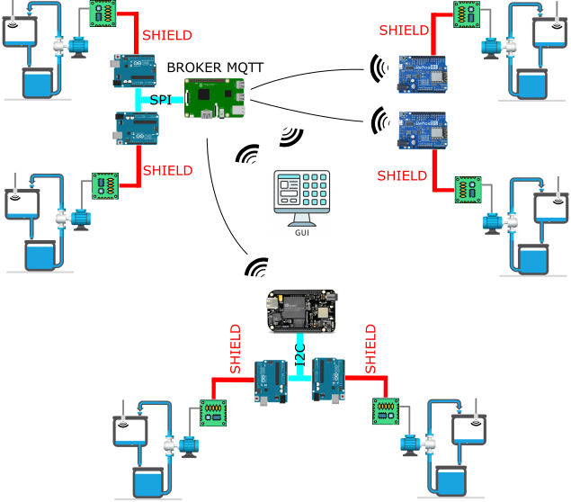

# tank-level-control
Level Control of 6 tanks using embedded systems like Beaglebone, Raspberry Pi, Arduino Uno and Wemos D1 and publishing data to a Python GUI over MQTT

## IoT Architecture


In this project the IoT architecture consists in:
- Two tanks are controlled by an Arduino Uno for each one with a PID algorithm controller, these arduinos will be communicating sensor data and PID parameters to the Raspberry Pi through SPI bus communication.
- Two other tanks are also be controlled by an Arduino Uno for each one with a PID algorithm controller, these arduinos will be communicating sensor data and PID parameters to the Beaglebone through I2C bus communication.
- The last two tanks are controlled by a Wemos D1 for each one, these wemos devices will be communicating sensor data and PID parameters through MQTT with the broker.
- Raspberry Pi and Beaglebone are WiFi and MQTT gateways for the arduinos, publishing and subscribing topics to manage the tanks through GUI Control Center.
- The MQTT broker will be installed in the Raspberry Pi.

## Installation
### GUI
Firstly, clone the repository to your local folder
```bash
git clone https://github.com/davidadrianrg/tank-level-control
```
After that, edit ```configuration.yaml``` file with your network and bus settings
Make sure you have installed the python dependencies for this project.
You can do it using ```pip3``` python package manager.
```bash
pip3 install matplotlib tk paho.mqtt pyyaml
```

### Raspberry Pi
Copy ```raspberry.py``` and ```configuration.yaml``` files to your Raspberry Pi.
You can do that using the scp command for ssh communication:
```bash
scp ./raspberry.py pi@your_raspberry_ip:/home/pi/tank-level-control/.
scp ./configuration.yaml pi@your_raspberry_ip:/home/pi/tank-level-control/.
```
Make sure you have installed the python dependencies for this project in your Raspberry Pi
You can do it using ```pip3``` python package manager.
```bash
pip3 install paho.mqtt pyyaml spidev
```
And install the mosquitto mqtt broker if you want to have it in your Raspberry pi
```bash
sudo apt-get install mosquitto
```
### Beaglebone
Copy ```beaglebone.py``` and ```configuration.yaml``` files to your Raspberry Pi.
You can do that using the scp command for ssh communication:
```bash
scp ./beaglebone.py debian@your_beaglebone_ip:/home/debian/tank-level-control/.
scp ./configuration.yaml debian@your_beaglebone_ip:/home/debian/tank-level-control/.
```
Make sure you have installed the python dependencies for this project in your Beaglebone
You can do it using ```pip3``` python package manager.
```bash
pip3 install paho.mqtt pyyaml smbus2
```
### Arduino Uno as I2C slave
Firstly, setup the same i2c slave address in ```slavei2c_arduino.ino``` as in your ```configuration.yaml``` file.
After that you can flash your arduino using the Arduino IDE
Repeat the process for the second arduino changing the slave address.
### Arduino Uno as SPI slave
This script is common for the two spi arduino slaves, you only have tu flash them using the Arduino IDE.
### Wemos D1
You need to setup your wifi and mqtt settings in ```wemosPID.ino```
```cpp
#define ssid "WIFISSID"
#define pswd "WIFIPASS"
#define brokerIP "YOUR_IP_BROKER"
#define brokerPort 1883
```
For the second wemos you must change the topics for the plant 6
```cpp
#define dataTopic "plant6/data"
#define parametersTopic "plant6/parameters"
#define getParametersTopic "plant6/get_parameters"
#define onoffTopic "plant6/on_off"
#define updateTopic "plant6/update_parameters"
```
## Usage
1. Make the electronics connections for i2c and spi buses, and for the arduino/wemos to the plants
2. Power on the arduinos and wemos
3. Execute ```raspberry.py``` and ```beaglebone.py``` using ssh into your Raspberry Pi and Beaglebone respectively
4. Run GUI control center from your computer executing ```gui_tank_level_control.py```
5. Just control your systems 